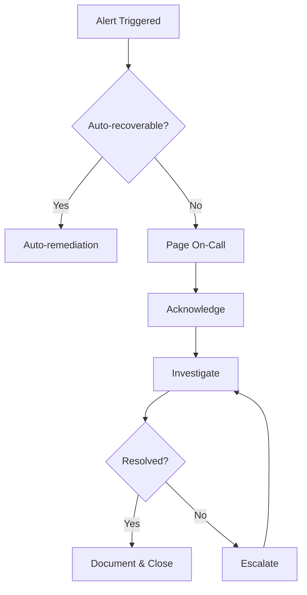

# Phoenix Guardian - Production Launch Runbook
## Sprint 73-76: GA Preparation

**Document Version:** 5.0.0  
**Last Updated:** 2026-02-02  
**Confidentiality:** Internal Use Only

---

## Table of Contents

1. [Pre-Launch Checklist](#pre-launch-checklist)
2. [Security Hardening](#security-hardening)
3. [Performance Validation](#performance-validation)
4. [Compliance Verification](#compliance-verification)
5. [Launch Day Procedures](#launch-day-procedures)
6. [Rollback Procedures](#rollback-procedures)
7. [Post-Launch Monitoring](#post-launch-monitoring)
8. [Incident Response](#incident-response)
9. [Contact Directory](#contact-directory)

---

## Pre-Launch Checklist

### Infrastructure Readiness

| Item | Owner | Status | Date Verified |
|------|-------|--------|---------------|
| AWS EKS cluster production-ready | Platform Team | ☐ | |
| Multi-AZ deployment verified | Platform Team | ☐ | |
| DR region (us-west-2) configured | Platform Team | ☐ | |
| RDS Global Database replication active | DBA | ☐ | |
| ElastiCache Global Datastore active | DBA | ☐ | |
| S3 cross-region replication enabled | Platform Team | ☐ | |
| Route 53 failover configured | Platform Team | ☐ | |
| SSL/TLS certificates valid (>90 days) | Security | ☐ | |
| WAF rules configured and tested | Security | ☐ | |
| VPC flow logs enabled | Security | ☐ | |

### Application Readiness

| Item | Owner | Status | Date Verified |
|------|-------|--------|---------------|
| All unit tests passing (>95% coverage) | Dev Team | ☐ | |
| Integration tests passing | QA Team | ☐ | |
| E2E tests passing | QA Team | ☐ | |
| Performance tests passing (<5s SOAP generation) | Performance | ☐ | |
| Security scan clean (no critical/high vulnerabilities) | Security | ☐ | |
| HIPAA compliance audit passed | Compliance | ☐ | |
| Federated learning pipeline validated | ML Team | ☐ | |
| Privacy budget accounting verified | ML Team | ☐ | |
| CDS hooks integration tested | Dev Team | ☐ | |

### Operational Readiness

| Item | Owner | Status | Date Verified |
|------|-------|--------|---------------|
| Runbooks documented and reviewed | SRE | ☐ | |
| On-call rotation scheduled | SRE | ☐ | |
| PagerDuty escalation policies configured | SRE | ☐ | |
| Datadog dashboards configured | SRE | ☐ | |
| Alert thresholds validated | SRE | ☐ | |
| Chaos experiments completed successfully | SRE | ☐ | |
| DR failover tested (RTO < 15 min verified) | SRE | ☐ | |
| Backup and restore tested | DBA | ☐ | |

### Hospital Onboarding

| Item | Owner | Status | Date Verified |
|------|-------|--------|---------------|
| Pilot hospitals signed off | Customer Success | ☐ | |
| BAAs executed for all hospitals | Legal | ☐ | |
| EHR integrations tested | Integration Team | ☐ | |
| Training completed for pilot physicians | Training | ☐ | |
| Support escalation path documented | Support | ☐ | |

---

## Security Hardening

### Pre-Launch Security Tasks

```bash
# 1. Rotate all secrets and credentials
kubectl create secret generic phoenix-secrets \
  --from-literal=db-password="$(openssl rand -base64 32)" \
  --from-literal=redis-password="$(openssl rand -base64 32)" \
  --from-literal=jwt-secret="$(openssl rand -base64 64)" \
  --dry-run=client -o yaml | kubectl apply -f -

# 2. Verify KMS key rotation
aws kms get-key-rotation-status --key-id alias/phoenix-guardian-production

# 3. Run Trivy vulnerability scan
trivy image phoenix-guardian:5.0.0 --severity CRITICAL,HIGH

# 4. Verify network policies
kubectl get networkpolicies -n phoenix-production

# 5. Check RBAC configuration
kubectl auth can-i --list --as=system:serviceaccount:phoenix-production:phoenix-api
```

### Security Configuration Verification

```yaml
# Verify these settings in production:
security:
  # TLS Configuration
  tls_min_version: "1.3"
  cipher_suites:
    - TLS_AES_256_GCM_SHA384
    - TLS_CHACHA20_POLY1305_SHA256
  
  # Authentication
  jwt_expiration: "15m"
  refresh_token_expiration: "7d"
  mfa_required: true
  
  # Rate Limiting
  rate_limit_requests_per_minute: 100
  rate_limit_burst: 20
  
  # Session Management
  session_timeout: "30m"
  concurrent_sessions_max: 3
  
  # Headers
  security_headers:
    - "Strict-Transport-Security: max-age=31536000; includeSubDomains; preload"
    - "X-Content-Type-Options: nosniff"
    - "X-Frame-Options: DENY"
    - "Content-Security-Policy: default-src 'self'"
```

---

## Performance Validation

### Load Test Requirements

| Metric | Target | Actual | Status |
|--------|--------|--------|--------|
| Concurrent users | 1,000 | | ☐ |
| SOAP generation p50 latency | <2s | | ☐ |
| SOAP generation p95 latency | <5s | | ☐ |
| SOAP generation p99 latency | <8s | | ☐ |
| API throughput | 500 req/s | | ☐ |
| Error rate | <0.1% | | ☐ |
| ML inference latency p95 | <1s | | ☐ |
| CDS evaluation latency p95 | <500ms | | ☐ |

### Load Test Commands

```bash
# Run k6 load test
k6 run \
  --vus 1000 \
  --duration 30m \
  --out datadog \
  tests/performance/load_test.js

# Run specific SOAP generation test
k6 run \
  --vus 100 \
  --duration 10m \
  tests/performance/soap_generation.js

# Stress test
k6 run \
  --vus 2000 \
  --duration 15m \
  --rps 1000 \
  tests/performance/stress_test.js
```

### Scaling Configuration

```yaml
# HPA settings for launch
apiVersion: autoscaling/v2
kind: HorizontalPodAutoscaler
metadata:
  name: phoenix-api
spec:
  scaleTargetRef:
    apiVersion: apps/v1
    kind: Deployment
    name: phoenix-api
  minReplicas: 5
  maxReplicas: 50
  metrics:
    - type: Resource
      resource:
        name: cpu
        target:
          type: Utilization
          averageUtilization: 70
    - type: Resource
      resource:
        name: memory
        target:
          type: Utilization
          averageUtilization: 80
  behavior:
    scaleUp:
      stabilizationWindowSeconds: 60
      policies:
        - type: Percent
          value: 100
          periodSeconds: 60
    scaleDown:
      stabilizationWindowSeconds: 300
      policies:
        - type: Percent
          value: 10
          periodSeconds: 60
```

---

## Compliance Verification

### HIPAA Compliance Checklist

| Requirement | Control | Verification | Status |
|-------------|---------|--------------|--------|
| Access Control (164.312(a)(1)) | RBAC, MFA | Audit logs reviewed | ☐ |
| Audit Controls (164.312(b)) | CloudWatch, audit trail | Log retention verified | ☐ |
| Integrity (164.312(c)(1)) | Checksums, TLS | Data integrity tests | ☐ |
| Transmission Security (164.312(e)(1)) | TLS 1.3, mTLS | SSL Labs A+ rating | ☐ |
| Encryption (164.312(a)(2)(iv)) | KMS, AES-256 | Key management audit | ☐ |
| Breach Notification | Alerting, runbook | Incident response drill | ☐ |

### SOC 2 Type II Controls

| Control | Evidence | Status |
|---------|----------|--------|
| CC1: Control Environment | Policies, org chart | ☐ |
| CC2: Communication | Training records | ☐ |
| CC3: Risk Assessment | Risk register | ☐ |
| CC4: Monitoring | Dashboards, alerts | ☐ |
| CC5: Control Activities | Procedures | ☐ |
| CC6: Logical Access | RBAC audit | ☐ |
| CC7: System Operations | Runbooks | ☐ |
| CC8: Change Management | GitOps audit | ☐ |
| CC9: Risk Mitigation | DR tests | ☐ |

### Privacy Compliance

| Requirement | Implementation | Status |
|-------------|----------------|--------|
| Differential Privacy | ε ≤ 2.0 per hospital | ☐ |
| Data Minimization | Only necessary PHI accessed | ☐ |
| Purpose Limitation | Audit trail per access | ☐ |
| Consent Management | Consent records maintained | ☐ |
| Right to Erasure | Deletion workflow tested | ☐ |
| Data Portability | Export functionality tested | ☐ |

---

## Launch Day Procedures

### T-24 Hours

- [ ] Final code freeze
- [ ] Production deployment completed
- [ ] All tests passing
- [ ] Stakeholder notification sent
- [ ] War room scheduled

### T-4 Hours

- [ ] Health check all services
- [ ] Verify all monitoring active
- [ ] On-call team briefed
- [ ] Customer success team ready
- [ ] Communication channels open

### T-0 Launch

```bash
# 1. Enable production traffic
kubectl patch ingress phoenix-api -n phoenix-production \
  --type=json \
  -p='[{"op": "replace", "path": "/metadata/annotations/nginx.ingress.kubernetes.io~1whitelist-source-range", "value": "0.0.0.0/0"}]'

# 2. Verify traffic flowing
kubectl logs -n phoenix-production -l app=phoenix-api --tail=100 -f

# 3. Monitor error rates
curl -s "http://prometheus:9090/api/v1/query?query=rate(http_requests_total{status=~'5..'}[5m])"

# 4. Check HPA scaling
kubectl get hpa -n phoenix-production -w
```

### T+1 Hour

- [ ] Error rate < 0.1%
- [ ] Latency within SLO
- [ ] No critical alerts
- [ ] Customer feedback positive
- [ ] Go/No-Go decision

### T+24 Hours

- [ ] Full traffic analysis
- [ ] Performance report generated
- [ ] Customer satisfaction survey sent
- [ ] Incident review (if any)
- [ ] Celebration! 🎉

---

## Rollback Procedures

### Automatic Rollback Triggers

| Condition | Threshold | Action |
|-----------|-----------|--------|
| Error rate | > 5% for 5 min | Automatic rollback |
| P99 latency | > 30s for 10 min | Alert + manual review |
| Pod restarts | > 10 in 5 min | Automatic rollback |
| Memory usage | > 90% for 15 min | Scale up + alert |

### Manual Rollback Procedure

```bash
# 1. Identify current and previous versions
kubectl rollout history deployment/phoenix-api -n phoenix-production

# 2. Rollback to previous version
kubectl rollout undo deployment/phoenix-api -n phoenix-production

# 3. Verify rollback
kubectl rollout status deployment/phoenix-api -n phoenix-production

# 4. Notify stakeholders
./scripts/notify_rollback.sh

# 5. Create incident
./scripts/create_incident.sh --type=rollback --severity=P2
```

### Database Rollback

```bash
# Point-in-time recovery (if needed)
aws rds restore-db-cluster-to-point-in-time \
  --source-db-cluster-identifier phoenix-guardian-production \
  --db-cluster-identifier phoenix-guardian-recovery \
  --restore-to-time 2026-02-02T10:00:00Z \
  --use-latest-restorable-time
```

---

## Post-Launch Monitoring

### First 24 Hours

| Metric | Check Frequency | Owner |
|--------|-----------------|-------|
| Error rate | Every 5 min | SRE |
| Latency p95 | Every 5 min | SRE |
| Pod health | Every 1 min | SRE |
| Database connections | Every 5 min | DBA |
| Redis memory | Every 5 min | DBA |
| ML inference latency | Every 5 min | ML Team |

### First Week

| Activity | Frequency | Owner |
|----------|-----------|-------|
| Daily standup | Daily | All |
| Error analysis | Daily | Dev Team |
| Performance review | Daily | SRE |
| Customer feedback review | Daily | CS Team |
| Capacity planning | End of week | Platform |

### Key Dashboards

1. **Phoenix Overview** - High-level system health
2. **API Performance** - Request rates, latency, errors
3. **ML Inference** - Model performance, GPU utilization
4. **Database Health** - Connections, queries, replication lag
5. **Federated Learning** - Training rounds, privacy budget
6. **Hospital Dashboards** - Per-tenant metrics

---

## Incident Response

### Severity Levels

| Level | Definition | Response Time | Escalation |
|-------|------------|---------------|------------|
| P1 | Service down, PHI at risk | 5 min | VP Engineering |
| P2 | Major feature impacted | 15 min | Engineering Manager |
| P3 | Minor feature impacted | 1 hour | Team Lead |
| P4 | Low priority issue | 24 hours | Team Queue |

### Incident Workflow



### Communication Templates

**Customer-Facing Status Page Update:**
```
[Phoenix Guardian Status Update]
Time: YYYY-MM-DD HH:MM UTC
Status: Investigating / Identified / Monitoring / Resolved

Summary: Brief description of the issue.

Impact: Description of user impact.

Next Update: Expected time of next update.
```

---

## Contact Directory

### On-Call Rotation

| Role | Primary | Secondary | Escalation |
|------|---------|-----------|------------|
| SRE On-Call | [PagerDuty] | [PagerDuty] | platform-oncall@phoenix.health |
| DBA On-Call | [PagerDuty] | [PagerDuty] | dba-oncall@phoenix.health |
| Security On-Call | [PagerDuty] | [PagerDuty] | security@phoenix.health |

### Stakeholders

| Role | Contact | Notify When |
|------|---------|-------------|
| VP Engineering | vp-eng@phoenix.health | P1/P2 incidents |
| VP Customer Success | vp-cs@phoenix.health | Customer impact |
| CISO | ciso@phoenix.health | Security incidents |
| Legal | legal@phoenix.health | Breach suspicion |

### External Contacts

| Vendor | Purpose | Contact |
|--------|---------|---------|
| AWS Support | Infrastructure | AWS Console |
| Datadog Support | Monitoring | support@datadoghq.com |
| PagerDuty Support | Alerting | support@pagerduty.com |

---

## Appendix A: Launch Go/No-Go Criteria

### GO Criteria (All must be met)

- [ ] All P1/P2 bugs resolved
- [ ] Load tests passing at 150% expected capacity
- [ ] Security scan shows 0 critical, 0 high vulnerabilities
- [ ] DR failover tested successfully
- [ ] All pilot hospitals signed off
- [ ] On-call team trained and scheduled
- [ ] Legal/compliance approval received

### NO-GO Triggers

- Any unresolved P1 bug
- Security vulnerability with CVSS > 7.0
- Load test failure at expected capacity
- Outstanding compliance finding
- Missing BAA for any hospital
- On-call coverage gap

---

## Appendix B: Post-Mortem Template

```markdown
# Incident Post-Mortem: [INCIDENT_ID]

## Summary
- **Date:** YYYY-MM-DD
- **Duration:** X hours Y minutes
- **Severity:** P1/P2/P3
- **Impact:** Description

## Timeline
- HH:MM - Event
- HH:MM - Event
- HH:MM - Resolution

## Root Cause
Description of root cause.

## Resolution
How the incident was resolved.

## Action Items
| Item | Owner | Due Date | Status |
|------|-------|----------|--------|
| | | | |

## Lessons Learned
- What went well
- What could be improved

## Prevention
Steps to prevent recurrence.
```

---

*Document Owner: Platform Engineering*  
*Review Cycle: Quarterly*  
*Next Review: 2026-05-01*
